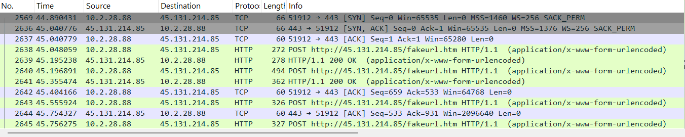
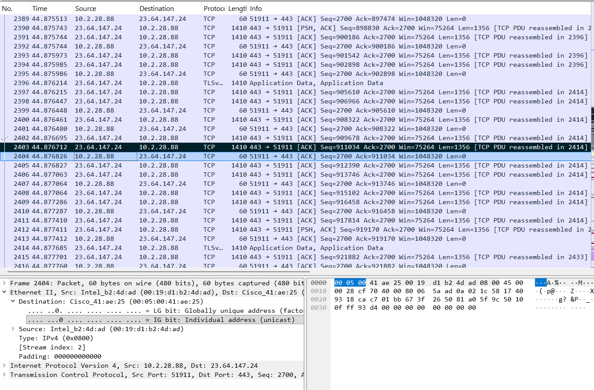
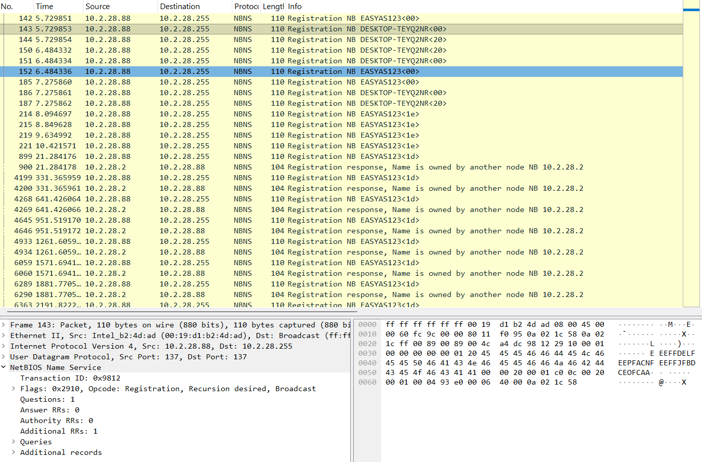

# SOC Investigation: NetSupport RAT Traffic Analysis

## Overview
In this investigation, I analyzed network traffic from a suspected compromised host after SIEM alerts indicated potential malicious activity involving NetSupport Manager RAT.

The objective was to identify the infected machine and gather key details to support incident response.

---

## Environment Details
- Internal Network: 10.2.28.0/24
- Domain: easyas123.tech
- Domain Controller: 10.2.28.2
- Gateway: 10.2.28.1

---

## Detection Summary
SIEM alerts identified suspicious traffic originating from an internal host communicating with:

- External IP: 45.131.214.85
- Port: TCP 443
- Activity: Repeated beaconing behavior

---

## Investigation Process
Using Wireshark, I performed the following steps:

1. Filtered traffic to isolate communication with the suspicious external IP
2. Identified repeated connections indicating command-and-control (C2) activity
3. Traced the internal source of the traffic
4. Analyzed NetBIOS traffic to determine host identity

---

## Key Findings

### Infected Host Details
- IP Address: 10.2.28.88
- MAC Address: 00:19:d1:b2:4d:ad
- Hostname: DESKTOP-TEYQ2NR

### Observations
- The infected host maintained continuous communication with the external IP
- Traffic patterns were consistent with command-and-control behavior
- NetSupport Manager RAT indicators were observed in HTTP traffic

---

## Conclusion
The analysis confirmed that the host at 10.2.28.88 was compromised and communicating with a known malicious server.

Immediate containment and remediation actions are recommended.

---

## Tools Used
- Wireshark
